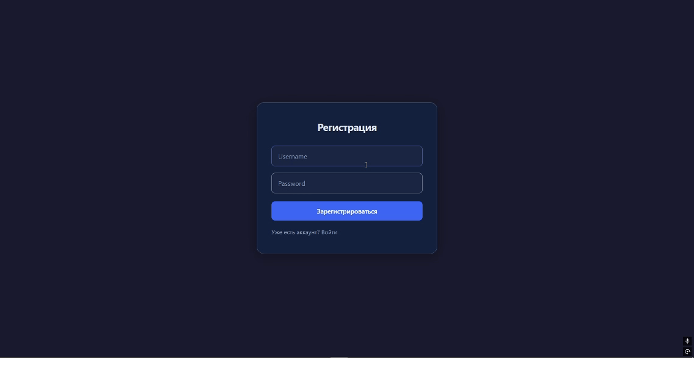

[](https://github.com/14shagov/coursework/actions/workflows/test.yml)
[](https://www.python.org/downloads/)

# RAG Chatbot

RAG-чатбот. Пользователь ведёт отдельные диалоги в режимах `PLAIN` и `RAG`. В `RAG`-режиме приложение ищет подходящие фрагменты базы знаний через pgvector и передаёт их модели как контекст.

<p align="center">
  
</p>

## Архитектура

```text
React/Vite (web) -> Spring Boot (java-service) -> FastAPI (python-service) -> LLM / embedding routers
                             |
                             -> PostgreSQL + pgvector
```

| Компонент | Технологии | Назначение | Порт |
|---|---|---|---|
| `web` | React, Vite | Интерфейс чата | 8081 в Docker, 5173 локально |
| `java-service` | Java 21, Spring Boot, JPA, Liquibase | REST API, JWT, диалоги, RAG-поиск | 8080 |
| `python-service` | Python, FastAPI, OpenAI SDK | Клиенты chat и embedding роутеров | 8000 |
| `postgres` | PostgreSQL 16, pgvector | Пользователи, сообщения, чанки, векторы | 5432 |

## Как работает RAG

1. При создании диалога выбирается `PLAIN` или `RAG`; режим не меняется в истории этого диалога.
2. В `PLAIN` Java service отправляет историю сообщений Python service, а тот — LLM.
3. В `RAG` Java service создаёт embedding вопроса через Python service.
4. PostgreSQL ищет до пяти близких чанков по cosine similarity.
5. Чанки с similarity ниже порога отбрасываются. Базовый порог приложения — `0.35`.
6. Оставшиеся чанки добавляются в system message. LLM получает инструкцию отвечать только по этому контексту.
7. Если контекста нет, пользователь получает сообщение, что данные в базе знаний не найдены.

## Требования

- Docker Desktop и Docker Compose v2 — для полного запуска;
- Java 21 и Maven 3.9+ — для Java-тестов и локальной разработки backend;
- Node.js 18+ — для локальной разработки frontend;
- Python 3.12 — только при запуске Python service вне Docker.

## Конфигурация

Создайте `.env` по шаблону:

```bash
cp .env.example .env
```

| Переменная | Назначение |
|---|---|
| `POSTGRES_DB`, `POSTGRES_USER`, `POSTGRES_PASSWORD` | Параметры PostgreSQL |
| `GITHUB_TOKEN` | Ключ chat/LLM роутера |
| `EMBEDDING_GITHUB_TOKEN` | Ключ embedding роутера; не должен совпадать с ключом LLM, если используются разные провайдеры |
| `LLM_MODEL` | Модель генерации ответа |
| `EMBEDDING_MODEL` | Модель векторизации |
| `CHAT_API_BASE_URL` | OpenAI-compatible URL chat роутера |
| `EMBEDDING_API_BASE_URL` | OpenAI-compatible URL embedding роутера |
| `LLM_REASONING_EFFORT` | Уровень reasoning, передаваемый chat модели |

`.env` содержит секреты и не должен попадать в Git. Для командной работы зашифрованные переменные можно хранить в `.env.enc` через SOPS.

## Быстрый запуск

Production-like запуск использует готовые образы из GHCR:

```bash
docker compose up -d
```

После старта откройте `http://localhost:8081`.

Проверка service health:

```bash
curl http://localhost:8000/health
curl http://localhost:8080/swagger-ui.html
```

Остановить сервисы:

```bash
docker compose down
```

## Локальная разработка

Создайте `.env.dev` на основе `.env.example`, затем запустите сервисы с hot reload:

```bash
docker compose -f docker-compose.dev.yml up
```

В development compose доступны:

- PostgreSQL: `localhost:5432`;
- pgAdmin: `http://localhost:5050`;
- Java API: `http://localhost:8080`;
- Python OpenAPI: `http://localhost:8000/docs`.

Frontend можно запускать отдельно:

```bash
cd web
npm install
npm run dev
```

Vite откроется на `http://localhost:5173` и проксирует `/api` в Java service.

## API

Полная спецификация доступна после запуска: `http://localhost:8080/swagger-ui.html`.

| Метод | Путь | Назначение |
|---|---|---|
| `POST` | `/api/auth/register` | Регистрация и получение JWT |
| `POST` | `/api/auth/login` | Вход и получение JWT |
| `POST` | `/api/conversations` | Создать диалог в `PLAIN` или `RAG` |
| `GET` | `/api/conversations` | Список диалогов текущего пользователя |
| `GET` | `/api/conversations/{id}` | Получить диалог |
| `GET` | `/api/conversations/{id}/messages` | История сообщений |
| `POST` | `/api/conversations/{id}/messages` | Отправить обычный запрос |
| `POST` | `/api/conversations/{id}/messages/stream` | Отправить streaming-запрос через SSE |
| `POST` | `/api/admin/embeddings/jobs` | Создать задачу векторизации чанков |
| `GET` | `/api/admin/embeddings/jobs/{id}` | Получить статус задачи векторизации |

Защищённые Java API требуют заголовок:

```http
Authorization: Bearer <JWT>
```

## База знаний и embeddings

Liquibase применяет схему и astronomy seed при создании БД. Изначально у seed-чанков нет embeddings. Их можно заполнить через endpoint embedding job после авторизации или автоматически в live-eval.

Статус job содержит число обработанных, пропущенных и неуспешных чанков. RAG-поиск работает только по чанкам с заполненным полем `embedding`.

## Тесты

Обычные unit-тесты Java:

```bash
mvn -f java-service/pom.xml test
```

Python unit-тесты:

```bash
cd python-service
pip install -r requirements-dev.txt
pytest
```

## Live RAG eval

`Live RAG evaluation` — ручной GitHub Actions workflow `.github/workflows/live-eval.yml`. Он использует реальные модели, чистую PostgreSQL+pgvector Testcontainer БД и Python Testcontainer.

Перед запуском добавьте в GitHub repository secrets:

- `LIVE_EVAL_GITHUB_TOKEN` — ключ LLM роутера;
- `LIVE_EVAL_EMBEDDING_GITHUB_TOKEN` — ключ embedding роутера.

Workflow проверяет три вопроса: определение звезды, методы обнаружения экзопланет и спектральный класс Солнца. Для каждого он:

1. Векторизует весь astronomy seed реальной embedding-моделью.
2. Ищет expected chunk в top-5 при тестовом пороге similarity `0.7`.
3. Запрашивает реальные PLAIN и RAG ответы.
4. Требует, чтобы RAG использовал контекст, а PLAIN — нет.
5. Печатает оба ответа и keyword recall в Maven log.

## Структура проекта

```text
.
├── web/                 React frontend
├── java-service/        Spring Boot API и RAG-логика
├── python-service/      FastAPI clients для LLM и embeddings
├── docker-compose.yml   Production-like Docker stack
├── docker-compose.dev.yml
├── .env.example         Шаблон конфигурации
└── .github/workflows/   CI/CD и ручной live-eval
```
